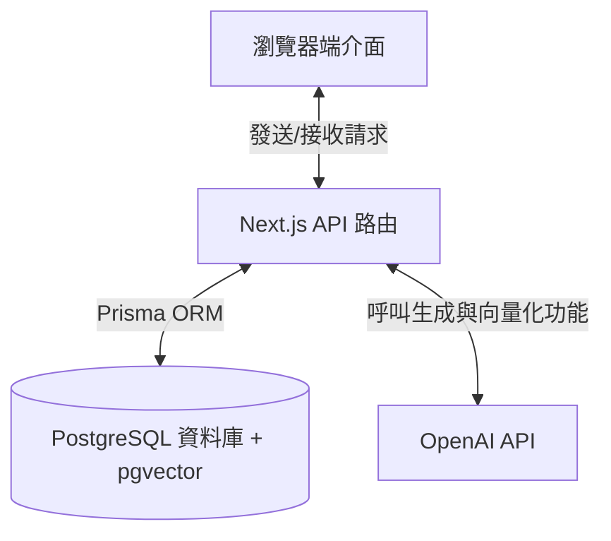
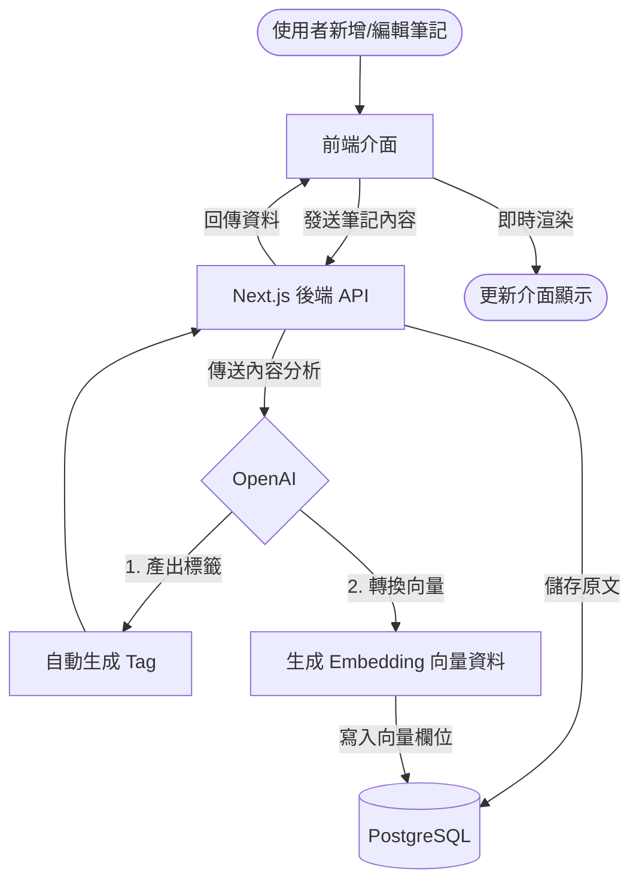

# SmartMark 專案規格文件

🚀 **AI 驅動的 Markdown 智能筆記與知識庫**

---

## 📌 核心理念 (Problem & Core Idea)

整理和檢索筆記往往耗時且缺乏效率。使用者需要一個更快速、更聰明的方式來管理 Markdown 筆記，而不必依賴繁瑣的手動標籤或毫無頭緒的搜尋。

➡️ **SmartMark 提供一個結合 AI 的編輯環境，能自動分類筆記，並透過語意關聯快速找出你需要的知識。**

---

## 🧑‍💻 目標用戶 (Users)

| Persona    | 核心需求                                                                   |
| :--------- | :------------------------------------------------------------------------- |
| **學生**   | 快速記錄上課筆記，依科目整理，並能在考前迅速找出相關的重點複習。           |
| **開發者** | 記錄程式碼片段與開發踩坑紀錄，依賴 AI 快速聯想並找出過往的解法與技術筆記。 |

---

## ✨ 核心功能 (Core Features)

### A) 筆記與編輯系統

- 支援手動新增、編輯與儲存 Markdown 筆記。
- 編輯器即時渲染 Markdown 語法（所見即所得編輯體驗，無需切換預覽視窗）。

### B) 組織與管理 (Collections & Tags)

- 使用者可手動建立 **Collection（資料夾）** 來分類筆記。
- 將特定筆記或 Collection 加入**最愛**。
- **釘選 (Pin)** 重要筆記至頂部。

### C) 匯入與匯出

- 支援匯入既有的 `.md` 檔案至平台。
- 支援將單篇或多篇筆記匯出為 `.md` 檔案。

### D) AI 賦能 (AI Superpowers)

- **自動標籤 (Auto-tagging)：** AI 根據筆記內容自動解析並生成關聯 Tag。
- **語意關聯搜尋 (Associative Search)：** 透過 AI 向量技術 (Embeddings)，輸入自然語言即可比對並列出具高度語意關聯的筆記。
- **AI Chatbot 助理：** 提供對話框，讓使用者直接詢問筆記內容、總結重點或尋求靈感。

### E) 會員與權限系統 (Authentication)

- 基礎帳號註冊與登入。
- 依照付費與否，限制筆記數量、Collection 上限以及 AI 功能的存取權限。

---

## 🧱 技術棧 (Tech Stack)

| 類別            | 技術選擇                                      |
| :-------------- | :-------------------------------------------- |
| **Framework**   | Next.js (App Router)                          |
| **Database**    | PostgreSQL (啟用 `pgvector` 擴充支援向量檢索) |
| **ORM**         | Prisma                                        |
| **AI Services** | OpenAI API (Text Generation & Embeddings)     |

---

## 💰 商業模式 (Monetization)

| 方案              | 功能與限制                                                                              |
| :---------------- | :-------------------------------------------------------------------------------------- |
| **Free (免費版)** | 包含基礎 Markdown 編輯功能。設有筆記與 Collection 的數量上限，無 AI 相關支援。          |
| **Pro (付費版)**  | 無上限的筆記與 Collection 額度，全面解鎖 AI 自動標籤、語意關聯搜尋與專屬 Chatbot 功能。 |

---

## 🎨 UI / UX 設計

- **主題風格 (Theme)：** - 淺色模式 (Light Mode)：參考 Notion 的極簡留白風格。
  - 深色模式 (Dark Mode)：以純黑底色為主，降低視覺疲勞。

### 版面配置 (Layout)

- **左側側邊欄 (Left Sidebar)：**
  - **筆記清單：** 條列顯示所有筆記。
  - **Collection 清單：** 條列顯示資料夾，點擊後展開顯示所屬筆記。
  - **Tag 清單：** 標籤名稱尾部以括號顯示關聯數量（例：`React (5)`），點開列出所屬筆記。
  - **帳號設定 (Settings)：** 包含個人資料與訂閱狀態。
- **中央工作區 (Main Workspace)：**
  - Markdown 編輯器，支援語法即時渲染。
- **右側側邊欄 (Right Sidebar)：**
  - **關聯搜尋框：** 讓使用者輸入想找的內容，並即時列出 AI 推薦的相關筆記。
  - **AI Chatbot：** 與 AI 助理對話的互動視窗。

---

## UI快照（Screenshots）

dashboard UI參考以下截圖, 不用完全一致。
Use it as r reference:

- @context/screenshots/dashboard-ui-main.png
- @context/screenshots/dashboard-ui-drawer.png
- @context/screenshots/dashboard-ui-viewer.png

## 🔌 系統架構 (API Architecture)



---

## 🧠 AI 功能流程 (AI Feature Flow)



---

## 🗄️ 資料庫模型 (Data Model - Prisma)

> **注意：** 為了支援 AI 語意搜尋，本專案已啟用 PostgreSQL 的 `pgvector` 擴充功能，用來儲存筆記內容的 Embedding 向量資料。

```prisma
generator client {
  provider        = "prisma-client-js"
  previewFeatures = ["postgresqlExtensions"] // 啟用擴充功能預覽
}

datasource db {
  provider   = "postgresql"
  url        = env("DATABASE_URL")
  extensions = [vector] // 啟用 pgvector
}

model User {
  id          String       @id @default(cuid())
  email       String       @unique
  password    String?
  isPro       Boolean      @default(false)

  notes       Note[]
  collections Collection[]
  tags        Tag[]

  createdAt   DateTime     @default(now())
  updatedAt   DateTime     @updatedAt
}

model Note {
  id           String      @id @default(cuid())
  title        String      @default("未命名筆記")
  content      String?
  isFavorite   Boolean     @default(false)
  isPinned     Boolean     @default(false)

  // 儲存 AI 向量資料的欄位 (使用 OpenAI text-embedding-3-small 的 1536 維度)
  embedding    Unsupported("vector(1536)")?

  userId       String
  user         User        @relation(fields: [userId], references: [id], onDelete: Cascade)

  collectionId String?
  collection   Collection? @relation(fields: [collectionId], references: [id], onDelete: SetNull)

  tags         NoteTag[]

  createdAt    DateTime    @default(now())
  updatedAt    DateTime    @updatedAt
}

model Collection {
  id          String   @id @default(cuid())
  name        String
  isFavorite  Boolean  @default(false)

  userId      String
  user        User     @relation(fields: [userId], references: [id], onDelete: Cascade)

  notes       Note[]

  createdAt   DateTime @default(now())
  updatedAt   DateTime @updatedAt
}

model Tag {
  id            String    @id @default(cuid())
  name          String
  isAiGenerated Boolean   @default(false)

  userId        String
  user          User      @relation(fields: [userId], references: [id], onDelete: Cascade)

  notes         NoteTag[]
}

model NoteTag {
  noteId String
  tagId  String

  note   Note @relation(fields: [noteId], references: [id], onDelete: Cascade)
  tag    Tag  @relation(fields: [tagId], references: [id], onDelete: Cascade)

  @@id([noteId, tagId])
}
```

---

## 🧭 開發藍圖 (Roadmap)

### 第一階段：MVP (最小可行性產品)

- 專案環境建置 (Next.js + Prisma + PostgreSQL)
- 設定 `pgvector` 資料庫環境
- 筆記 CRUD (新增、讀取、更新、刪除) 與 Markdown 即時渲染
- Collection 資料夾分類功能
- 基礎關鍵字搜尋與手動標籤功能

### 第二階段：AI 與進階功能

- 串接 OpenAI API 實作自動標籤 (Auto-tagging)
- 實作筆記內容 Embedding 向量化寫入流程
- 實作 AI 語意關聯搜尋與 Chatbot
- 實作匯入 / 匯出 Markdown 檔案功能

### 第三階段：會員與部署

- 建立會員註冊/登入系統
- 劃分 Free 與 Pro 使用權限
- 專案部署上線
